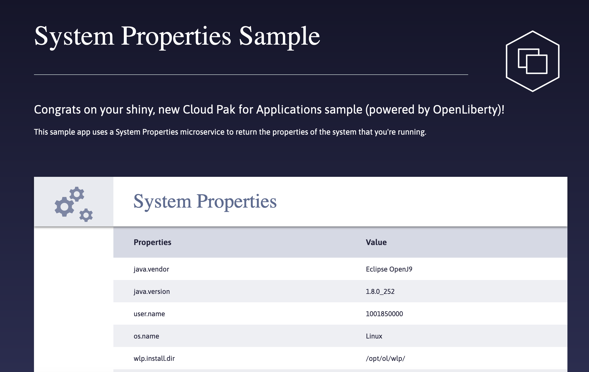

#  Sysprop - Display System Properties Sample
The **Sysprop** sample is a simple sample that displays a subset of the system properties inside the container. The sample has no dependencies on external services (in order to keep the sample simple).  This sample is designed to test the deployment of a single container, based on the OpenLiberty runtime. The sample, is currently based on a Appsody runtime.
| | |
|---|---|
| Runtime | OpenLiberty |
| Stack Version | docker.io/kabanero/java-openliberty:0.2 |
| Deployment Namespace | Sysprop |
| Build Tool | Appsody (buildah) |

## Installation
By default the appsody deploy yaml attempts to deploy this into the Sysprop namespace.  The system administrator will need to create the sysprop name space, and add it to the Kabanero operator running into the Accelerator for Team name space (kabanero operator). Once this is complete, you should be able to check this project into a repository into which has the appropriate webhook to cause it to be built and deployed.

